<div style=" width: 100%; height:40;overflow: hidden; "><iframe src="https://widget.pkmer.cn/free/miniTianqi?user=d8bc5ad7-89bd-45c7-9fe5-525a37000038&select-theme=tf&theme=%E7%BB%8F%E5%85%B8&input-text=%E9%83%91%E5%B7%9E&theme-color=%23A77777FF&select-icon=pear" allow="fullscreen" style=" height: 100%; width: 100%;"></iframe></div>

## 📊 核心指标看板 
```dataviewjs
// 需安装Dataview插件
dv.table(["工作强度", "学习深度", "兴趣指数", "今日"], 
 [[this.page('').work, this.page('').learn, this.page('').interesting, this.page('').mood]])
```

## 🎯 每日任务
### 🔴 高优先级
- [ ] #task/work 工作流模块根据后端情况进行对接 :LiWorkflow:
- [ ] #task/work 动火作业页面梳理优化逻辑
- [ ] #task/learn 高级JavaScript学习-微前端 

### 🟡 中优先级
- [ ] #task/life 记录生活 ✍

### 🟢 低优先级
- [ ] #task/life summary 🚟

## ⏳ 时间轨迹

```mermaid
%%{init: {'theme':'default', 'themeVariables': { 'fontSize': '20px'}, 'gantt': { 'fontSize': 22 }}}%%
gantt
    title 每日时间分布
    dateFormat HH:mm
    axisFormat %H:%M
    section 工作时段
    核心开发       :09:30, 120m
    section 学习时段
    Vue源码阅读    :20:00, 60m
	section 生活时段
    每日日程安排和follow阅读           :08:30, 40m
```


## 📌 每日三问
1. 今日最大突破：_________________
2. 最值得延续的模式：_________________
3. 必须停止的消耗：

## 🚩expectation

> [!important]
> 要有趣啊

![[新年计划]]


## 📝 memo

- 08:50 
	#daily/2025/03 #saySome 
	##### 小孩子的快乐
	早上出门的时候，返现小区门禁的开关的旁边贴了一个敖丙的贴纸，想起来我小的时候也到处贴过很多贴纸，和现在的这种还不太一样，是那种类似纹身的贴纸，小时候都是贴到身上，然后把膜撕掉，身上就留下了一个卡通的画。不过印象中，这张画过了一段时间之后，因为是粘的，导致粘了好多脏东西，黑乎乎的。🤣
	小时候的贴纸应该都是买泡泡糖，里面带的，现在想来应该也不是什么好东西，不过那时候快乐的获取也是真的简单。
	
	刚上班的路上听的《凑近点看》的播客，这一期的主题的下雨天，主播讲述了小时候，下雨时在双杠下的沙坑进行的防洪工事😄，我不记得有没有这样的时刻了，但是小时候的那个我，肯定也在雨中有过奔跑🏃‍♀️，现在想来，那种纯粹的自由，纯粹的快乐真是难得。
	
	前几天还听了东东枪的《宇宙牌电饭锅》，小孩大会的第二期（神秘嘉宾威哥现身，小威替父发声🤣），主题主要和几个小朋友聊他们的朋友，很有趣的一期节目，这个系列希望以后还有。
	东东枪在结尾的时候也说了，希望可以常做这个系列的节目，直到这些孩子变得和大人一样无趣了。
	
	长大如果意味着变得无趣，孩童时期就是我们这些无趣的大人永远的怀念，这样的播客就是在祭典，在缅怀那段无忧无虑的时光。
- 13:34 
	#daily/2025/03 #interest
	
	中午遛弯的路上，用识别花草的软件识别了一种花，得到的答案是樱桃李，但是通义告诉我是樱花，然后我就和他一起探讨了这两种花的区别，学到了单瓣，半重瓣，重瓣的新知识。
	
	简单说，单瓣就是一层，简单四五片，中间是花心，而重瓣就多了，很容易就能想到玫瑰或者其他的。
	
	我识别的很明显是单瓣花，所以是樱桃李而不是樱花，樱花是重瓣的。
	![[Pasted image 20250314133558.png]]
	
	我让通义生成几张樱花照片，他给我的还是单瓣花🤔🤔🤔，我去网上搜了一下樱花照片，重瓣花很明显的要长得复杂一些