<div style=" width: 100%; height:40;overflow: hidden; "><iframe src="https://widget.pkmer.cn/free/miniTianqi?user=d8bc5ad7-89bd-45c7-9fe5-525a37000038&select-theme=tf&theme=%E7%BB%8F%E5%85%B8&input-text=%E9%83%91%E5%B7%9E&theme-color=%23A77777FF&select-icon=pear" allow="fullscreen" style=" height: 100%; width: 100%;"></iframe></div>

## 📊 核心指标看板 
```dataviewjs
// 需安装Dataview插件
dv.table(["工作强度", "学习深度", "兴趣指数", "今日"], 
 [[this.page('').work, this.page('').learn, this.page('').interesting, this.page('').mood]])
```

## 🎯 每日任务
### 🔴 高优先级
- [x] #task/work 动火作业接口对接
- [ ] #task/learn 高级JavaScript知识学习

### 🟡 中优先级
- [x] #task/life 记录生活 ✍
- [x] #task/life Obsidian插件开发

### 🟢 低优先级
- [x] #task/life summary 🚟

## ⏳ 时间轨迹

```mermaid
%%{init: {'theme':'default', 'themeVariables': { 'fontSize': '20px'}, 'gantt': { 'fontSize': 22 }}}%%
gantt
    title 每日时间分布
    dateFormat HH:mm
    axisFormat %H:%M
    section 工作时段
    核心开发       :09:30, 120m
    section 学习时段
    Vue源码阅读    :20:00, 60m
	section 生活时段
    每日日程安排和follow阅读           :08:30, 40m
```


## 📌 每日三问
1. 今日最大突破：_________________
2. 最值得延续的模式：_________________
3. 必须停止的消耗：

## 🚩expectation

> [!important]
> 要有趣啊

![[新年计划]]

## 📝 memo

- 09:35 
	#daily/2025/03 #quote 
	
	“他们在做一件事的时候不是只想要「做到最好」，他是很专注在这一刹那。”
	**“我一做我就进去了，这是解脱。”**
	
	圆桌派
	![[Pasted image 20250321093550.png]]
- 09:36 
	**人投入感情的东西，是没有办法去计算性价比的。**
	![[Pasted image 20250321093644.png]]
	纪录片《一百年很长吗》
	
	#daily/2025/03 #quote  

- 17:04
 	#work/workRecod
	动火作业接口对接，修改逻辑，完成动火作业工作流审批流程