<div style=" width: 100%; height:40;overflow: hidden; "><iframe src="https://widget.pkmer.cn/free/miniTianqi?user=d8bc5ad7-89bd-45c7-9fe5-525a37000038&select-theme=tf&theme=%E7%BB%8F%E5%85%B8&input-text=%E9%83%91%E5%B7%9E&theme-color=%23A77777FF&select-icon=pear" allow="fullscreen" style=" height: 100%; width: 100%;"></iframe></div>

## 📊 核心指标看板 
```dataviewjs
// 需安装Dataview插件
dv.table(["工作强度", "学习深度", "兴趣指数", "今日"], 
 [[this.page('').work, this.page('').learn, this.page('').interesting, this.page('').mood]])
```

## 🎯 每日任务
### 🔴 高优先级
- [ ] #task/work 巡检模块根据后端情况对接
- [ ] #task/work 工作流组件接入，待确认效果
- [ ] #task/work 检查已写的前端模块，查漏补缺
- [ ] #task/learn JavaScript高级知识学习

### 🟡 中优先级
- [ ] #task/life 记录生活 ✍

### 🟢 低优先级
- [ ] #task/life summary 🚟

## ⏳ 时间轨迹

```mermaid
%%{init: {'theme':'default', 'themeVariables': { 'fontSize': '23px'}, 'gantt': { 'fontSize': 25 }}}%%
gantt
    title 每日时间分布
    dateFormat HH:mm
    axisFormat %H:%M
    section 工作时段
    巡检路线接口对接       :09:30, 60m
    公司内部工作流组件接入  :09:50, 30m
    section 学习时段
	section 生活时段
    follow和玩           :08:30, 60m
    只用trae尝试开发一个类似flomo的Obsidian插件 :10:50, 60m
```


## 📌 每日三问
1. 今日最大突破：_________________
2. 最值得延续的模式：_________________
3. 必须停止的消耗：

## 🚩expectation

> [!important]
> 要有趣啊

![[新年计划]]

## 📝 memo

- 08:47 
	#daily/2025/03 #seen 
	早上遛狗的时候见了树枝上的麻雀，感觉和小时候见到的很不一样，大小是差不多的，但是颜色有很大差别，小时候的印象是浅褐色，早上见的是深褐色，印象中在哪里听过我国本土麻雀在除四害时基本被捕灭绝，后来引进了外国品种，但是具体的时间和品种，样子不知道，所以就问了一下deepseek。
	1. **颜色与体型差异**：
	    - **本土麻雀**：羽毛以浅褐色为主，带有黑色纵纹。
	    - **引进麻雀**：体色更深（深褐色或栗褐色），部分头顶有白色斑点。  
	        你提到的深褐色麻雀可能是引进品种或杂交后代。
	2. **杂交与种群更替**：  
	    苏联引进的树麻雀与残存的本土麻雀杂交，形成混合种群。如今中国大部分地区的麻雀已非纯本土品种
	
	根据这个结果，我的印象好像是对的，但是看引进的时间是上世纪五十年代末到六十年代初，所以到我小时候，应该是大部分都是引进品种，少量本土的，或者更多的都是杂交的。但是感觉印象中的和现在的完全不一样，难道是小时候还有本土品种的存在，或者杂交后的本土基因越来越少了？
	
	```mermaid
	pie 
	title 中国麻雀种类占比 
	"树麻雀（含杂交种）" : 85 
	"家麻雀" : 10 
	"山麻雀等其他种类" : 5
	```
